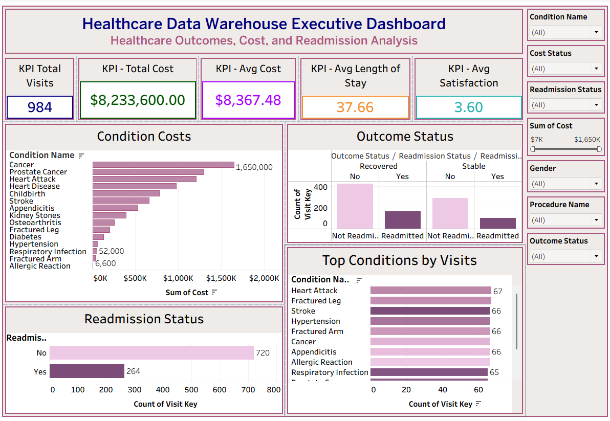
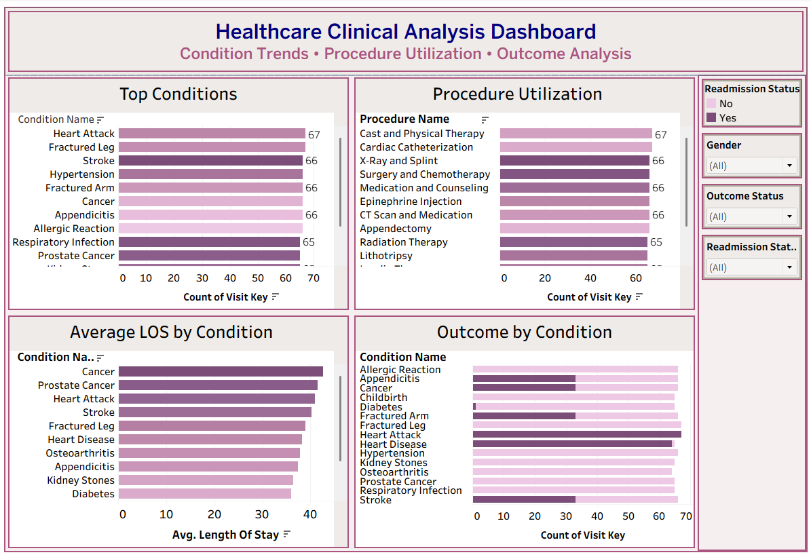
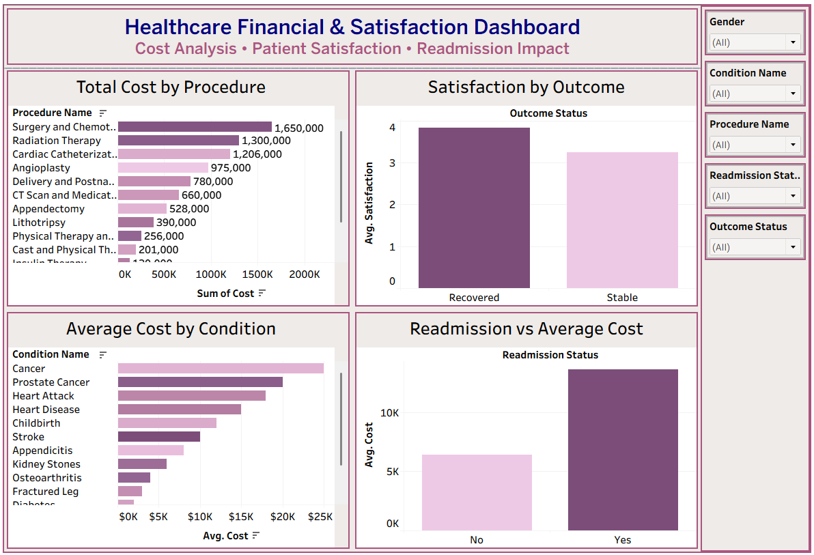
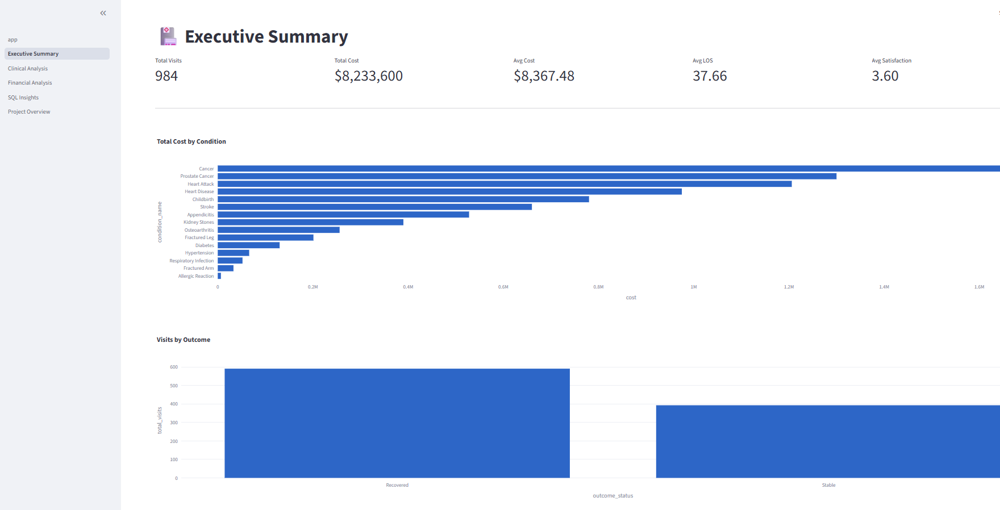
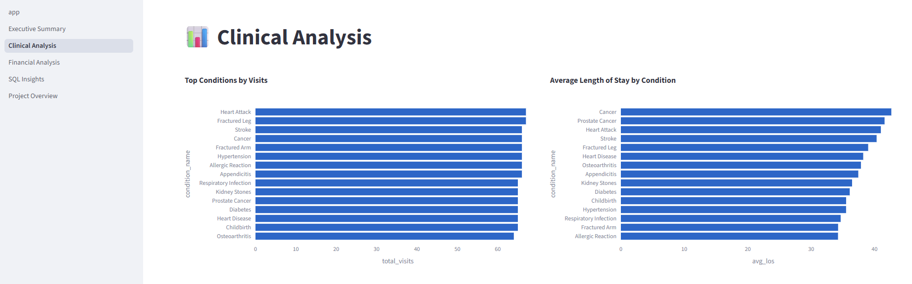
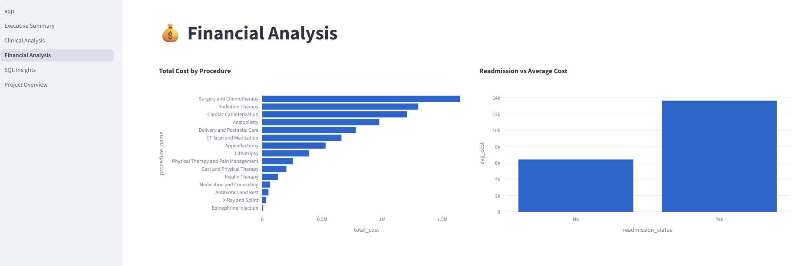
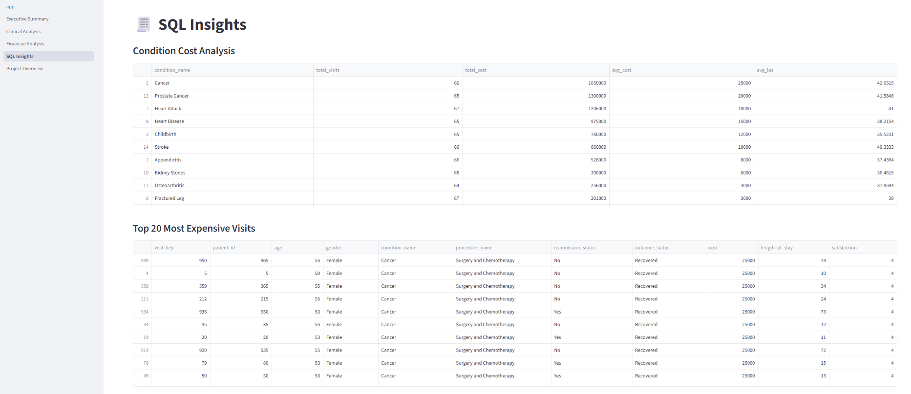

# Healthcare Data Warehouse & Analytics Platform

## Project Overview

This project demonstrates the design and implementation of an end-to-end Healthcare Data Warehouse and Analytics Platform using PostgreSQL, SQL, Python, Tableau, and Streamlit.

The project transforms raw healthcare patient data into a structured analytics-ready warehouse using a Star Schema design, performs advanced SQL analysis, and delivers business insights through interactive dashboards.

---

## Business Problem

Healthcare organizations generate large amounts of patient data from admissions, procedures, treatments, and outcomes. Raw transactional data is difficult to analyze efficiently.

The objective of this project is to:

* Build a Healthcare Data Warehouse
* Design a Star Schema for analytical reporting
* Implement ETL processes
* Analyze patient outcomes and healthcare costs
* Identify readmission trends
* Develop executive-level dashboards
* Deliver insights through Tableau and Streamlit

---

## Technology Stack

| Technology | Purpose                           |
| ---------- | --------------------------------- |
| PostgreSQL | Data Warehouse                    |
| SQL        | ETL & Analytics                   |
| Python     | Data Processing & Validation      |
| Pandas     | Data Manipulation                 |
| SQLAlchemy | Database Connectivity             |
| Tableau    | Business Intelligence Dashboards  |
| Streamlit  | Interactive Analytics Application |
| GitHub     | Version Control & Portfolio       |

---

## Dataset

The project uses a synthetic healthcare dataset containing:

* Patient demographics
* Medical conditions
* Procedures
* Length of stay
* Treatment costs
* Readmission status
* Patient outcomes
* Satisfaction scores

### Dataset Features

| Feature        | Description                |
| -------------- | -------------------------- |
| Patient_ID     | Unique patient identifier  |
| Age            | Patient age                |
| Gender         | Patient gender             |
| Condition      | Medical condition          |
| Procedure      | Treatment procedure        |
| Cost           | Healthcare cost            |
| Length_of_Stay | Hospital stay duration     |
| Readmission    | Readmission indicator      |
| Outcome        | Patient outcome            |
| Satisfaction   | Patient satisfaction score |

---

## Data Warehouse Architecture

```text
Raw CSV Files
       │
       ▼
Staging Table
(stg_healthcare)
       │
       ▼
ETL Process
       │
       ▼
Dimension Tables
       │
       ▼
Fact Table
       │
       ▼
SQL Analytics
       │
       ▼
Tableau Dashboards
       │
       ▼
Streamlit Application
```

---

## Star Schema Design

### Fact Table

#### fact_patient_visit

Contains healthcare visit metrics:

* Cost
* Length of Stay
* Satisfaction
* Visit Count

### Dimension Tables

#### dim_patient

* Patient ID
* Age
* Gender

#### dim_condition

* Medical Conditions

#### dim_procedure

* Healthcare Procedures

#### dim_readmission

* Readmission Status

#### dim_outcome

* Patient Outcomes

---

## Entity Relationship Diagram

```text
                dim_patient
                     │
                     │
dim_condition ── fact_patient_visit ── dim_procedure
                     │
                     │
            dim_readmission
                     │
                     │
                dim_outcome
```

---

## ETL Workflow

### Step 1

Load raw healthcare data into:

```sql
stg_healthcare
```

### Step 2

Populate dimension tables:

```sql
dim_patient
dim_condition
dim_procedure
dim_readmission
dim_outcome
```

### Step 3

Load analytics-ready fact table:

```sql
fact_patient_visit
```

### Step 4

Perform advanced SQL analysis.

---

## SQL Skills Demonstrated

### Joins

* INNER JOIN
* LEFT JOIN

### Aggregations

* SUM()
* AVG()
* COUNT()
* MAX()
* MIN()

### Common Table Expressions (CTEs)

```sql
WITH condition_costs AS (...)
```

### Window Functions

* RANK()
* ROW_NUMBER()

### Business Logic

* CASE WHEN

### Data Warehouse Concepts

* Star Schema
* Fact Tables
* Dimension Tables
* Surrogate Keys
* Foreign Keys
* ETL Pipelines

---

## Key Performance Indicators

| KPI                    | Value      |
| ---------------------- | ---------- |
| Total Visits           | 984        |
| Total Cost             | $8,233,600 |
| Average Cost           | $8,367     |
| Average Length of Stay | 37.66 Days |
| Average Satisfaction   | 3.60       |

---

## Key Business Insights

### Clinical Insights

* Heart Attack was among the most frequent conditions.
* Cancer patients experienced longer hospital stays.
* Procedure utilization varied significantly across treatment categories.

### Financial Insights

* Surgery and Chemotherapy generated the highest healthcare costs.
* Cancer and Prostate Cancer were among the most expensive conditions.
* Readmitted patients incurred substantially higher costs.

### Outcome Insights

* Recovered patients reported higher satisfaction scores.
* Readmission status was associated with increased healthcare spending.

---

# Tableau Dashboards

## Executive Overview Dashboard



### Features

* Executive KPI Cards
* Cost by Condition
* Outcome Analysis
* Readmission Analysis
* Top Conditions by Visits

---

## Clinical Analysis Dashboard



### Features

* Top Conditions
* Procedure Utilization
* Average Length of Stay
* Outcome Analysis
* Interactive Filters

---

## Financial & Satisfaction Dashboard



### Features

* Cost by Procedure
* Average Cost by Condition
* Satisfaction Analysis
* Readmission Impact

Tableau Public Link : 

https://public.tableau.com/app/profile/humera.anjum/viz/healthcare-data-warehouse-project/ExecutiveOverview

---

# Streamlit Application

## Application Pages

### Executive Summary

* KPI Cards
* Cost Analysis
* Outcome Analysis

### Clinical Analysis

* Top Conditions
* Average Length of Stay

### Financial Analysis

* Procedure Cost Analysis
* Readmission Cost Impact

### SQL Insights

* Advanced SQL Results
* Cost Analysis
* Window Function Results

### Project Overview

* Architecture
* Methodology
* Skills Demonstrated

---

## Streamlit Dashboard






---

Streamlit Dashboard Live Link : 

https://healthcare-data-warehouse-project.streamlit.app/

---

## Project Structure

```text
healthcare-data-warehouse-project/
│
├── data/
│   ├── raw/
│   └── processed/
│
├── notebooks/
│   ├── 01_data_understanding.ipynb
│   └── 02_python_sql_validation.ipynb
│
├── sql/
│   ├── 01_create_tables.sql
│   ├── 02_load_staging_data.sql
│   ├── 03_insert_dimensions.sql
│   ├── 04_insert_fact_table.sql
│   └── 05_advanced_sql_analysis.sql
│
├── tableau/
│   └── dashboard_screenshots/
│
├── reports/
│   └── sql_screenshots/
│
├── streamlit_app/
│   ├── app.py
│   ├── data_loader.py
│   └── pages/
│
├── requirements.txt
├── .gitignore
└── README.md
```

---

## How to Run

### Clone Repository

```bash
git clone https://github.com/HumsShaik/healthcare-data-warehouse-project.git
```

### Create Virtual Environment

```bash
python -m venv venv
```

### Activate Environment

Windows:

```bash
venv\Scripts\activate
```

### Install Requirements

```bash
pip install -r requirements.txt
```

### Run Streamlit

```bash
cd streamlit_app

streamlit run app.py
```

---

## Future Enhancements

* Cloud PostgreSQL Deployment
* Azure Data Factory ETL Pipeline
* Healthcare Claims Analytics
* Machine Learning Readmission Prediction
* Real-Time Healthcare Monitoring
* Automated Data Quality Checks

---

## Author

**Humera Anjum**

Healthcare Analytics | SQL | Python | Tableau | Streamlit | Data Warehousing

GitHub: https://github.com/HumsShaik/

LinkedIn: www.linkedin.com/in/humera-anjum-98273a209


---

⭐ If you found this project useful, please consider giving the repository a star.
